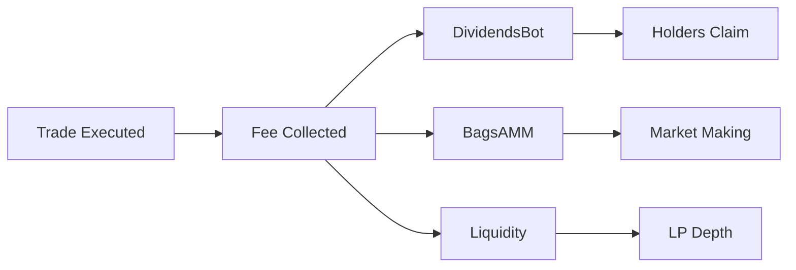

# bagsball Tokenomics

## Overview

bagsball is a flywheel-style meme coin built on the Bags ecosystem, integrating two key primitives:
1. **DividendsBot** - For holder rewards
2. **BagsAMM** - For automated market making

## Token Specifications

### Basic Parameters

| Parameter | Value |
|-----------|-------|
| **Name** | bagsball |
| **Symbol** | $bagsball |
| **Blockchain** | Solana |
| **Total Supply** | 1,000,000,000 (1B) |
| **Decimals** | 9 |
| **Launch Platform** | Bags |
| **Supply Model** | Fixed (no minting) |

### Distribution at Launch

```
100% - Fair launch via Bags
  └─ No team allocation
  └─ No presale
  └─ No private sale
  └─ No locked tokens
```

All tokens enter circulation at launch through Bags mechanism.

## Fee Structure

### Trading Fees

When launching on Bags, trading fees are configured as follows (example allocation):

```
Trading Fee: 1-5% per transaction (set at launch)
  │
  ├─ 50% → DividendsBot (holder rewards)
  ├─ 30% → BagsAMM (market making)
  └─ 20% → Liquidity Pool (optional)
```

**Note**: Exact percentages are determined at launch and verifiable on-chain.

### Fee Routing



## Flywheel Mechanics

### Phase 1: Accumulation

- Trades generate fees
- Fees route to DividendsBot and BagsAMM
- Both bots accumulate until thresholds met

### Phase 2: Activation

**DividendsBot**:
- Threshold reached → dividends become claimable
- Holders claim proportionally
- Cycle resets

**BagsAMM**:
- Sufficient fees → begins market making
- Places strategic buy/sell orders
- Increases volume

### Phase 3: Reinforcement

- AMM activity → higher volume
- Higher volume → more fees
- More fees → larger dividends + stronger AMM
- **Loop continues**

## Value Flows

### For Holders

```
Hold bagsball
    ↓
Trading happens
    ↓
Fees accumulate in DividendsBot
    ↓
Claim dividends (SOL/fees)
    ↓
Benefit from AMM support
```

### For Traders

```
Trade bagsball
    ↓
Pay small fee
    ↓
Fee supports dividends & AMM
    ↓
Better liquidity for next trade
```

### Flywheel Effect

```
Volume ↗
    ↓
Fees ↗
    ↓
Dividends ↗ + AMM Support ↗
    ↓
Holder Interest ↗
    ↓
Volume ↗ (cycle repeats)
```

## Incentive Alignment

### Holders

**Incentivized to**:
- Hold for dividend eligibility
- Promote trading volume
- Build community

**Benefit from**:
- Proportional dividend share
- Improved liquidity (AMM)
- Volume-driven rewards

### Traders

**Incentivized to**:
- Trade actively
- Arbitrage opportunities

**Benefit from**:
- AMM-supported liquidity
- Reduced slippage
- Active market

### Community

**Incentivized to**:
- Attract new participants
- Increase visibility
- Drive volume

**Benefit from**:
- Network effects
- Collective rewards
- Shared success

## Comparison: Traditional vs. bagsball

| Aspect | Traditional Meme | bagsball |
|--------|------------------|----------|
| Rewards | Manual/none | Automated dividends |
| Liquidity | Static LP | Active AMM support |
| Value Capture | Speculation only | Fees + speculation |
| Sustainability | Hype-driven | Volume-driven |
| Transparency | Variable | On-chain verifiable |

## Economic Model

### Supply Side

- **Fixed supply**: No inflation
- **Circulating supply**: 100% from launch
- **No burns**: Supply remains constant

### Demand Side

- **Speculation**: Meme value
- **Dividends**: Yield on holdings
- **Utility**: Participation in Bags ecosystem
- **Community**: Social value

### Value Accrual

Value accrues through:
1. **Direct**: Dividend payments to holders
2. **Indirect**: Liquidity improvements from AMM
3. **Network**: Growing community and volume

## Bags Meta Alignment

### $1M Market Cap Incentive

Bags offers $100K reward to tokens reaching $1M market cap:

- **Target**: $1M market cap
- **Reward**: $100K from Bags
- **Benefit**: Boosts liquidity and visibility
- **Competition**: Drives community effort

### How bagsball Competes

```
Community Growth
    ↓
Volume Increases
    ↓
Market Cap Grows
    ↓
Approaching $1M Target
    ↓
Increased Focus & Marketing
    ↓
Reach $1M → Claim $100K Reward
    ↓
Reward → Liquidity/Dividends/Community
```

## Risk Factors

### Market Risks

- Meme coins are highly volatile
- No guaranteed floor price
- Liquidity can vary
- Market cap may not reach targets

### Dividend Risks

- Dependent on trading volume
- No minimum payout guaranteed
- Timing unpredictable
- May not cover gas fees for small holders

### Integration Risks

- DividendsBot operated by Bags team
- BagsAMM operated by Bags team
- bagsball doesn't control bot logic
- Bot changes/issues possible

### Competitive Risks

- Other tokens competing for $1M reward
- Bags ecosystem evolution
- Market attention shifts

## What bagsball Does NOT Promise

❌ **Not Promised**:
- Guaranteed dividends
- Specific dividend amounts
- Dividend timing
- Price appreciation
- Reaching $1M market cap
- Claiming Bags reward
- Protection from losses

✅ **What IS Promised**:
- Transparent integration with Bags bots
- On-chain verifiable configuration
- Fair launch (no presale/team allocation)
- Community-driven approach
- Clear documentation

## Long-Term Vision

### Phase 1: Launch (Weeks 1-4)
- Launch on Bags
- Configure DividendsBot + BagsAMM
- Deploy dashboard
- Build initial community

### Phase 2: Growth (Months 2-3)
- First dividend cycles
- AMM activation
- Volume growth
- Community expansion

### Phase 3: Maturity (Month 4+)
- Established flywheel
- Regular dividend cycles
- Active AMM support
- Potential for $1M target

### Sustainable Model

```
Active Community
    ↕
Regular Trading
    ↕
Consistent Fees
    ↕
Reliable Dividends + AMM
    ↕
Holder Satisfaction
    ↕
Long-term Viability
```

## Transparency Commitment

All key metrics are verifiable:
- ✅ Token supply: On-chain
- ✅ Fee configuration: On-chain
- ✅ Bot integration: On-chain
- ✅ Dividend history: On-chain
- ✅ AMM activity: On-chain

Dashboard provides real-time visibility into:
- Total supply
- Circulating supply
- Holder count
- Fee accumulation status
- Integration verification

## Disclaimer

This tokenomics document is for informational purposes only. It does not constitute financial, investment, legal, or tax advice. bagsball is a meme coin designed for entertainment and community participation.

**Key Points**:
- Not a security or investment product
- No guaranteed returns
- High risk of loss
- Consult professionals before participating
- DYOR (Do Your Own Research)

## Questions?

For more information:
- Read integration docs (BAGS_AMM.md, DIVIDENDS_BOT.md)
- Review holder's guide (HOLDERS_GUIDE.md)
- Check dashboard for live data
- Join community channels

---

**Remember**: bagsball is an experiment in automated flywheel mechanics. Participate responsibly and only with funds you can afford to lose.
